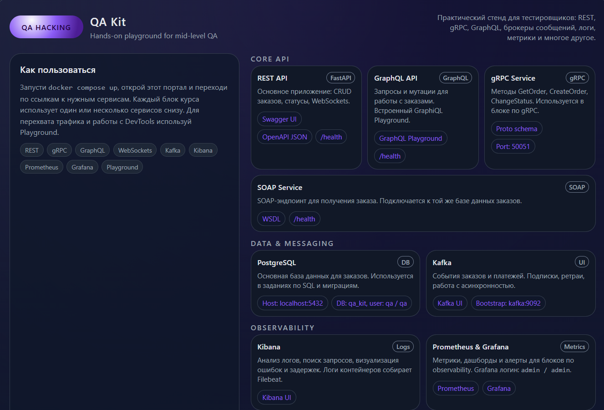

# 🧪 QA Kit — локальная учебная лаборатория для миддл-тестировщиков

**QA Kit** — это полностью локальный, Docker-based стенд для обучения миддл-тестировщиков современным технологиям. Создан специально для курса **«Инженер по тестированию Middle»** от Юлии Горшковой.

Студент разворачивает лабораторию одной командой и получает доступ к мини-инфраструктуре, максимально приближённой к реальной:

* REST API (CRUD + статусные переходы)
* WebSockets
* gRPC
* GraphQL
* PostgreSQL
* Kafka
* Mock-сервисы (WireMock)
* Kibana (логи)
* Prometheus / Grafana (метрики)
* Jaeger (трейсинг)
* API Gateway (rate limiting)
* Два вспомогательных фронтенда

Все сервисы запускаются внутри Docker и полностью изолированы — ничего не требуется устанавливать на компьютер.

<p align="center">
  
</p>
---

## 🔥 Где обучаться на Middle QA Engineer

QA Kit — учебный стенд, который используется в полном курсе подготовки Middle QA.

### 🇷🇺 Курс с оплатой в рублях
[https://ermita.one/courses/inzhener-po-testirovaniju-middle/](https://ermita.one/courses/inzhener-po-testirovaniju-middle/)

### 🇪🇺 Курс с оплатой в евро
[https://gradebuilder.tech/courses/inzhener-po-testirovaniju-middle/](https://gradebuilder.tech/courses/inzhener-po-testirovaniju-middle/)

### 📣 Telegram-канал проекта
[https://t.me/qahacking](https://t.me/qahacking)

---

# 🚀 Быстрый старт

[Инструкция](https://github.com/yugoru/qa_kit/blob/main/docs/guides/start.md)

# 🧩 Структура проекта

```
qa_kit/
│
├── services/                # Бэкенд-сервисы
│   ├── api-rest/            # FastAPI: REST + WebSockets
│   ├── grpc-service/        # gRPC микросервис
│   ├── graphql-service/     # GraphQL API
│   ├── mock-service/        # WireMock внешних сервисов
│   └── worker-kafka/        # Kafka consumer
│
├── frontends/
│   ├── portal/              # Фронтенд №1: навигация по сервисам
│   └── playground/          # Фронтенд №2: UI для ручных запросов
│
├── infra/                   # Инструменты наблюдаемости и инфраструктура
│   ├── postgres/
│   ├── kafka/
│   ├── elasticsearch/
│   ├── kibana/
│   ├── grafana/
│   └── jaeger/
│
└── docker-compose.yml
```

---

# 🛠 Используемые технологии

| Категория     | Технологии                                         |
| ------------- | -------------------------------------------------- |
| Backend       | FastAPI, SQLAlchemy, Python 3.11                   |
| Messaging     | Kafka (RabbitMQ позже)                             |
| Databases     | PostgreSQL, Redis, MongoDB (будет позже)           |
| API           | REST, GraphQL, gRPC, WebSockets                    |
| Observability | Kibana, Elasticsearch, Prometheus, Grafana, Jaeger |
| Mocking       | WireMock                                           |
| Gateway       | Traefik / Kong                                     |
| Frontend      | Минималистичные HTML/JS-интерфейсы                 |

---

# 📦 Возможности API (на текущий момент)

* Создание заказа (`POST /orders`)
* Получение заказа (`GET /orders/{id}`)
* Список заказов (`GET /orders`)
* Статусные переходы:

  * `/pay`
  * `/ship`
  * `/deliver`
  * `/cancel`
* Бизнес-ограничения переходов (state machine)

---

# 🎓 Для кого этот проект

* Тестировщики уровня Middle
* QA Automation инженеры, расширяющие кругозор
* Руководители QA команд
* Люди, изучающие API, брокеры сообщений, тестирование интеграций
* Разработчики, которые хотят прокачать QA-культуру

---

# ❤️ Автор проекта

**Юлия Горшкова** —  15+ лет в IT · QA Lead · архитектор тестовых систем. Обучаю QA инженеров.

* 🇷🇺 Курс Middle QA в рублях: [https://ermita.one/courses/inzhener-po-testirovaniju-middle/](https://ermita.one/courses/inzhener-po-testirovaniju-middle/)
* 🇪🇺 Курс Middle QA в евро: [https://gradebuilder.tech/courses/inzhener-po-testirovaniju-middle/](https://gradebuilder.tech/courses/inzhener-po-testirovaniju-middle/)
* 📨 Telegram-канал проекта: [https://t.me/qahacking](https://t.me/qahacking)

---

# ⭐ Поддержка

Если проект оказался вам полезен — поставьте ⭐ на GitHub. Это помогает другим находить проект и развивать его дальше.
